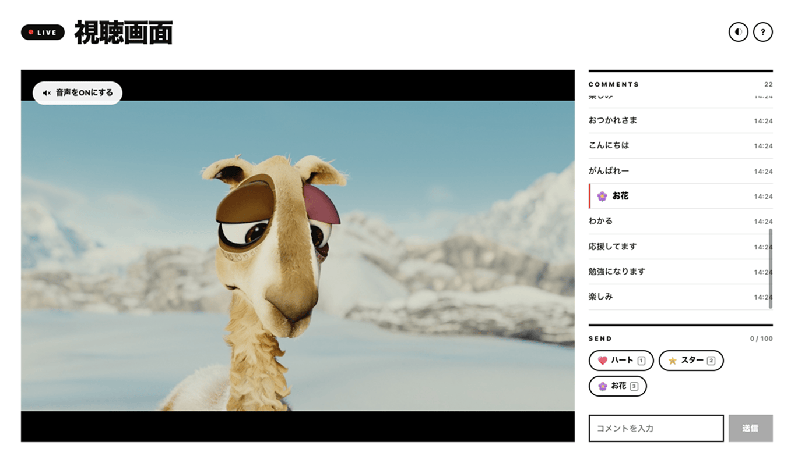
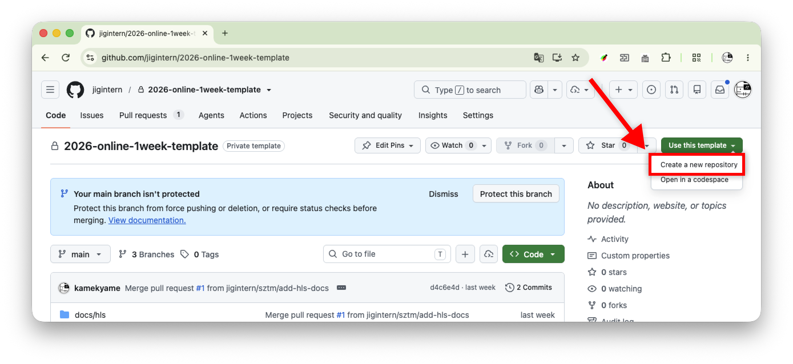
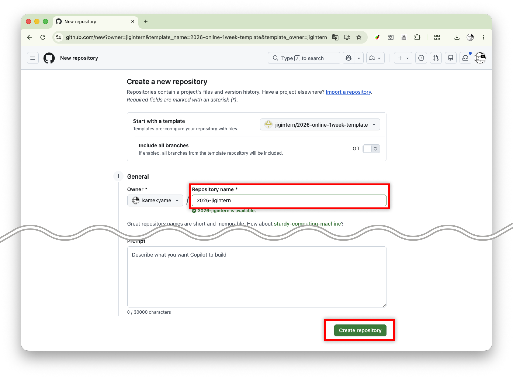
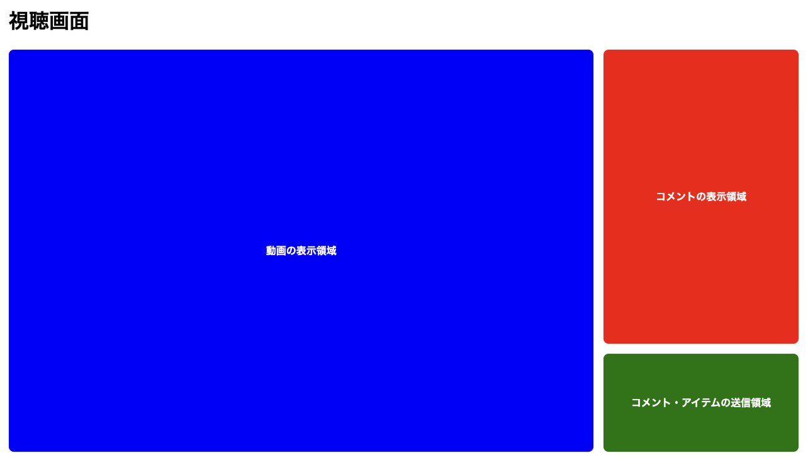

<!-- _class: lead -->
<!-- _paginate: false -->

# 実際に視聴画面を作ってみよう


---

# この講義でやること


- 小さな単位での実装
- ブラウザでの動作確認
- AIが書いたコードの理解

AIと相談しながら、視聴画面を作っていきましょう！

---

# 作るもの

ライブ配信を見ながら、コメントやアイテムで参加できる画面（視聴画面）

- ライブ配信動画の再生
- コメントの表示
- コメントの入力・送信
- アイテム一覧の取得・選択
- アイテム、コメント付きアイテムの送信

動画、コメント、送信フォームを一つの画面へ！

---

<!-- _class: screenshot -->



---

# 進める順番

| Step | 作るもの |
| ---: | --- |
| 0 | テンプレートの準備 |
| 1 | UIの仮組み |
| 2 | 動画部分 |
| 3 | コメント受信 |
| 4 | コメント送信 |
| 5 | アイテム一覧取得 |
| 6 | アイテム送信・受信 |

---

# 各Stepの進め方

1. **このStepで作るもの**の確認
2. 仕様を元に**AIと実装**
3. **ブラウザで動作確認**
4. **変更されたコードを読んで理解**

動いたら終わりではなく、「なぜ動くか」まで確認してみましょう！

---

# AIが書いたコードを読もう

実装後に、次の順番で変更内容を確認しましょう。

1. **どのファイルの、どの部分が変わったか**を見る
2. 処理の流れを、自分の言葉で説明してみる
3. 分からない箇所は、AIやメンターに質問する

変更点やコードを見ても分からないところは、AIに聞いてみるのも一つの手です。

```text
このStepで変更された点と、処理の流れを簡潔に説明してください。
```

```text
このコードの意味が分かりません：[分からないコード]
```


---

<!-- header: Step 0 準備 -->
<!-- _class: exercise -->

# Step 0

## 開発の準備をしよう！

テンプレートの取得から起動確認まで

---

# このStepでやること

- GitHubのテンプレートから自分のリポジトリを作成
- VS Codeで自分のリポジトリをクローン
- 開発サーバーの起動
- ブラウザでの表示確認

まずは、実装を始められる状態を作りましょう！

---

<!-- _class: spec -->

# リポジトリの準備

テンプレートリポジトリを準備しているので、それを使用します

```text
https://github.com/jigintern/2026-online-1week-template
```

**GitHubで操作**

1. 「Use this template」→「Create a new repository」
2. 好きなリポジトリ名（例：2026-jigintern）を入力して「Create repository」で作成

---

<!-- _class: screenshot -->

1. 「Use this template」→「Create a new repository」



---

<!-- _class: screenshot -->

2. 好きなリポジトリ名（例：2026-jigintern）を入力して「Create repository」で作成



※ Ownerが自分のアカウントになっているか確認しましょう

---

# VS Codeでクローン

1. コマンドパレットを開く: `Cmd+Shift+P`
2. `Git: Clone`を選ぶ
3. 作成したリポジトリのURLを入力
4. 保存先を選び、クローン後にリポジトリを開く

---

# 開発サーバーを起動

VSCode上のターミナルで下記のコマンドを実行

```bash
deno task start
```

起動後、ターミナルに表示されたURLをブラウザで開きます。

---

# 確認

- テンプレートリポジトリを使って自分用のリポジトリを作成できた
- VS Codeでリポジトリをクローンして開けた
- 開発サーバーを起動できる
- 初期画面をブラウザで表示できる
- ファイルを変更できる

ここまでできたら、開発の準備は完了！

---

<!-- header: Step 1 UI仮組み -->
<!-- _class: exercise -->

# Step 1

## UIを仮組みしよう！

まずは画面の大きな枠組みから

---

# このStepで作るもの

中身を作る前に、三つの表示領域を配置！

- 動画の表示領域
- コメントの表示領域
- コメント・アイテムの送信領域

仮の背景色や枠線を付けて、それぞれの場所が分かる状態を目指しましょう。

---

<!-- _class: screenshot -->



---

<!-- _class: spec -->

# 仕様

## UIの仮組み

**必要な領域**

- 動画表示
- コメント表示
- コメント・アイテム送信

**このStepのゴール**

- 仮の領域で各UIの配置が分かる
- 実際の動画再生・API通信はまだ行わない

---

# AIへの依頼例

Manual モードで以下のプロンプトを送ってみましょう。

```text
ライブ配信の視聴画面を作ります。

まずは、次の領域を空のボックスとして配置してください。
- 動画の表示領域
- コメントの表示領域
- コメント・アイテムの送信領域

動画再生やAPI通信は、まだ実装しません。
```

---

# 確認

- 必要な領域を配置できている
- 中身や通信処理を追加せずにUIを仮組みできている

ここまでできたら、画面の土台は完成！

---

<!-- _class: optional -->

# 演習

- 各領域の幅や高さの調整
- 見出しや余白の調整
- 仮の背景色や枠線の変更
- 画面幅を変えたときの見え方の確認
- など


---

<!-- header: Step 2 動画 -->
<!-- _class: exercise -->

# Step 2

## 動画を表示しよう！

空の動画領域にライブ配信を追加

---

<!-- _class: spec -->

# 仕様

## 動画視聴

**配信URL**

```text
https://intern-hls-server.tdmi0e341.workers.dev/stream.m3u8
```

動画領域でライブ配信を再生。
コメント領域・送信領域は変更しないようにします。

---

# AIへの依頼例

少し複雑なので、Planモードで変更内容を決めてから実装をしてみましょう

```text
既存の動画領域で、HLS形式のライブ配信を再生ができるようにします。

まずは実装の計画と変更内容を教えてください。

配信URL:
https://intern-hls-server.tdmi0e341.workers.dev/stream.m3u8
```

---

# 確認

- 動画領域で配信を再生できる
- コメント領域・送信領域を変更せずに実装できる
- 動画再生までのコードの流れを説明できる


---

<!-- _class: optional -->

# 演習

- ページ表示時に自動再生できるように
- 標準コントロールバーの非表示
- など

---

<!-- header: Step 3 コメント・アイテム受信 -->
<!-- _class: exercise -->

# Step 3

## コメントとアイテムを受信しよう！

コメントとアイテムを画面へ表示

---

<!-- _class: spec -->

# 仕様

## コメント・アイテム受信

**SSEの接続先**

```text
GET https://intern-comment-server.intern-comment-server.deno.net/events
```

- `text`があればコメントを表示
- `item`があれば`item.iconUrl`と`item.name`でアイテムを表示
- コメントだけ・アイテムだけ・両方の投稿に対応

---

# 確認

- 定期的に届くコメントとアイテムを表示できる
- 受信したデータが画面に表示されるまでのコードの流れを説明できる


---

<!-- _class: optional -->

# 演習

- 新着コメントの背景色を一時的に変更
- コメント追加時のアニメーション
- コメントが増えたときの自動スクロール
- 接続中であることが分かる表示
- など

---

<!-- header: Step 4 コメント送信 -->
<!-- _class: exercise -->

# Step 4

## コメントを送信しよう！

入力欄と送信ボタンを動かす

---

<!-- _class: spec -->

# 仕様

## コメント送信

**送信先とデータ**

```http
POST https://intern-comment-server.intern-comment-server.deno.net/messages

{ "text": "こんにちは" }
```

- データはJSON形式で送信

---

# 確認

- 入力したコメントを送信できる
- 入力したコメントが送信されるまでのコードの流れを説明できる


---

<!-- _class: optional -->

# 演習

- 文字数制限（200文字までなど）
- 空文字・空白だけの送信防止
- Enterキーでの送信
- Shift+Enterでの改行
- 送信中の連続操作防止
- など

---

<!-- header: Step 5 アイテム一覧 -->
<!-- _class: exercise -->

# Step 5

## アイテム一覧を取得しよう！

APIのデータから選択UIを作成

---

<!-- _class: spec -->

# 仕様

## アイテム一覧

**取得先とデータ**

```text
GET https://intern-comment-server.intern-comment-server.deno.net/items
```

一覧の各データにある`id`、`name`、`iconUrl`を使います。

---


# 確認

- APIから取得したアイテムを表示できる
- APIから取得したデータが画面に表示されるまでのコードの流れを説明できる

---

<!-- _class: optional -->

# 演習

- アイテム一覧領域を閉じられるようにする
- など


---

<!-- header: Step 6 アイテム送信 -->
<!-- _class: exercise -->

# Step 6

## アイテムを送信しよう！

アイテムを一覧から選択して送信できるように

---

<!-- _class: spec -->

# 仕様

## アイテム送信

**送信先（JSON形式）**

```http
POST https://intern-comment-server.intern-comment-server.deno.net/messages
```

- コメントだけ: `text`を送信
- アイテムだけ: 選択したアイテムの`id`を`itemId`として送信
- 両方: `text`と`itemId`を送信

---

# 確認

- コメントだけを送信して表示できる
- アイテムだけを送信して表示できる
- コメントとアイテムを一緒に送信して表示できる
- 3つの送信ケースの違いをコードで説明できる

---

<!-- _class: optional -->

# 演習

- 送信後に入力欄を空にする
- 送信後にアイテムの選択を解除
- 送信中であることが分かる表示
- 送信に失敗した場合の表示
- など

送信前・送信中・送信後の状態を順番に確認してみましょう！

---

<!-- header: "" -->
<!-- _class: exercise -->

# ブラッシュアップ

## 好きな機能を実装してみよう！

---

# 改善する内容を決めよう

基本機能ができたら、もっと使いやすく、もっと楽しい画面へ！

- 使いにくい場所の洗い出し
- 追加したいアイデアの整理
- 優先順位の決定
- 限られた時間での実装範囲


---

# AIにレビューを頼む

これまでは、AIに実装を任せてきましたが、自分でコードを修正するのもいいです。
その場合は、AIに変更点をレビューしてもらいましょう


```text
〇〇の機能を実装してみました。レビューをお願いします。
```

